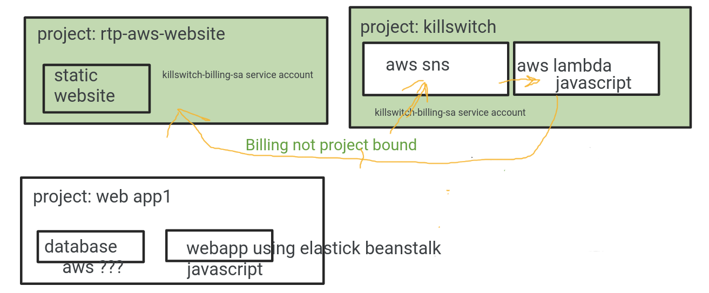

# killswitch_aws
A killswitch to disable services based upon cost

# overview

The project is comprised of :

* budget alerts
* SNS - Simple Notification Service
* Lambda 

The goal is that if costs exceed a threshold, the billing alert will trigger and publish a message
to SNS.  Consquently a lambda running javascript will trigger and disable services.  Desired services
to throttle are:

* S3
* elastik beanstalk
* etc

# urls of interest
* https://docs.aws.amazon.com/sdk-for-javascript/v3/developer-guide/javascript_s3_code_examples.html
* https://docs.aws.amazon.com/sdk-for-javascript/v3/developer-guide/sdk-code-samples.html
* https://docs.aws.amazon.com/AWSJavaScriptSDK/latest/AWS/S3.html#getBucketPolicy-property
* https://docs.aws.amazon.com/lambda/latest/dg/nodejs-context.html
* https://docs.aws.amazon.com/lambda/latest/dg/nodejs-handler.html
* [AWS SDK v2](https://docs.aws.amazon.com/AWSJavaScriptSDK/latest/top-level-namespace.html)
* [AWS SDK v3](https://docs.aws.amazon.com/AWSJavaScriptSDK/v3/latest/index.html)

# notes on code

* lambda.js - the code used for the lambda
* killswitch_topic_stub - the event which supposedly looks like the SNS event
* enable_topic_stub - the event which will enable services

